# 顶刊论文复现系列：远程办公与城市结构—当大都市的通勤不再回来（2026,AER）

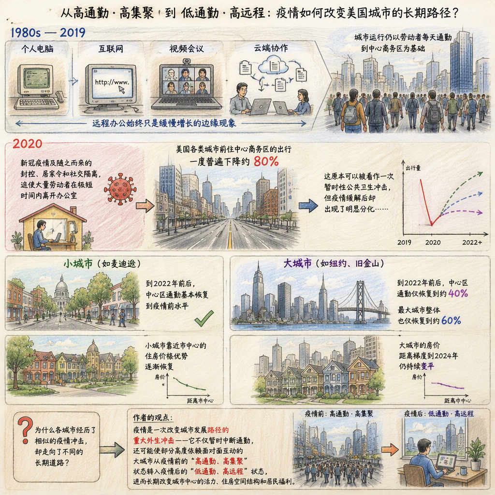


> **编者按：** 各位读者好，欢迎回到顶刊论文复现系列。每期小编陪你把一篇顶刊从背景故事读到理论模型，再读到量化估计与福利推断，带你层层拆解顶刊思路。
>
> 🍓🍓🍓🍓🍓🍓
>
> 本期我们选了 Monte, Porcher & Rossi-Hansberg（2026, AER）关于远程办公与城市结构的研究。疫情后，大城市的上班族回不到办公室，小城市却几乎完全恢复。同一次冲击，为什么留下截然不同的痕迹？答案落在「多重稳态与均衡选择」。这篇复现的重心放在代码上：从手机定位通勤数据、邮编级房价、微观工资面板，到转移弹性、集聚外部性的估计，再到每个城市是否处于多重性锥的判定与福利核算，我们把复现包里的完整代码逐段拆开讲。

> **本文代码复现基于以下研究，谨向作者致以谢意！**
>
> Monte, Ferdinando, Charly Porcher, and Esteban Rossi-Hansberg. "Remote Work and City Structure." *American Economic Review*, 2026, 116(8): 3152–3196.

> 代码与注释由Zhihan🍓Lin整理，仓库地址：https://github.com/Zhihan-iris/literature-reading/tree/main/remote-work-city-structure

> **本文关注的核心问题是：** 一次临时性的冲击（比如疫情封锁导致通勤人数降低）能否永久改变一座城市的结构？哪些城市会受影响，福利代价有多大？


## 背景与结论

2020 年初，办公室关门，上班族几乎在一夜之间转为居家办公。宽带、视频会议、云文档早已成熟，远程办公此前只停留在少数人和少数职业里，疫情把它变成了数亿人的日常。

封锁解除后，通勤的恢复出现了明显的分化。就业超过 150 万的大城市，到市中心的通勤流量稳定在疫情前的六成左右，此后没有继续回升；就业不足 15 万的小城市几乎完全恢复。

分化的根源，是远程办公改变了一个基本机制。上班族每天面对一个选择：去市中心的办公室，还是留在家远程办公。办公室的价值取决于有多少同事也来办公室，来的人越多，面对面协作与知识溢出越密集，市中心越有价值，反过来又吸引更多人来通勤。这是一个自我强化的循环，而且它有两个方向：大家一起通勤，或大家一起远程，都能自我维持。城市因此可能出现两个稳态，一个高通勤、一个低通勤。

疫情把一部分城市从高通勤稳态强行推到了低通勤稳态。一旦推过去，即使封锁结束，也没有力量把人再拉回来。大城市的通勤停在六成，是因为它已经换到了另一个稳态。

哪些城市会被永久改变，取决于两个参数。一是集聚外部性 δ，衡量多一个人来办公室、大家的工资涨多少；二是相对远程生产率 z/A，衡量在家办公与在办公室的效率对比。当 δ 超过某个门槛、z/A 落在一个区间内时，这座城市就存在多重稳态。

用手机定位、微观工资等七类数据估计出这些参数后逐城判定：参数齐全的 278 个都会区里，208 个在疫情前就处于多重性锥内。切换到低通勤稳态的福利损失平均 2.3%，区间从 1.2% 到 4.0%。这个数字温和，因为两个大数相抵：工资下降 15% 到 35%，被通勤成本节省与期权价值的变化抵消。

## 复现总览

结论建立在一套结构估计之上：先用手机定位与微观工资数据估计参数，再把参数代入动态离散选择模型，判定每个城市是否存在多重稳态，最后算福利。这条链条依赖七类数据。

- **SafeGraph 手机定位足迹**，商业授权数据。月度「出发街区组 × 目的街区组」的访问次数与设备数，是 CBD 定位与通勤访问份额的基础。
- **IPUMS 普查 / ACS**，来自 IPUMS USA。提供远程办公份额的时间趋势、职业构成、人口与就业。
- **NLSY79 微观面板**，来自美国劳工统计局。个体工资、每周远程小时与职业，用于估计转移弹性与远程工资溢价。
- **Zillow ZHVI**，来自 Zillow。邮编级房价指数，用于估计房价距离梯度。
- **NHGIS**，来自 IPUMS NHGIS。街区组租金与住房特征，用于估计租金距离梯度。
- **CBP 分行业就业**，来自人口普查局。各行业就业，用于 δ 的行业构成加权。
- **BEA 就业**，来自经济分析局。都会区就业规模，用于城市规模分组。

整条复现从原始数据一路跑到福利核算。先定位市中心：用 SafeGraph 的访问足迹搜出每个都会区的 CBD，后面所有距离都以此为准。再拼面板：把手机定位、房价、租金整理成通勤、房价、租金三块面板，并读入普查/ACS 与 NLSY 的微观数据。然后估计参数：远程办公份额、通勤缺口、房价距离梯度、转移弹性与切换成本、远程工资溢价、集聚外部性依次估计出来。接着做结构模型：把参数代进动态离散选择模型，逐城判定是否落在多重性锥内，核算切换到低通勤稳态的福利损失。最后出图，把福利分解、锥内份额等结果画出来。

整条流水线用到三种软件：Stata 完成绝大部分数据构建与参数估计；CBD 定位用 MATLAB（需要 Mapping Toolbox）；多重性锥与福利用 Mathematica 解非线性方程。后两步没法在 Stata 里完成，是整条流水线上仅有的两处手工操作。


## 一、远程办公的兴起

在估计任何参数之前，先要确认远程办公到底涨了多少、涨的是「人数」还是「生产率」。这两个问题对应正文第一节的两张子图：左边是远程办公份额的时间趋势，右边是远程办公的工资溢价。

份额用普查/ACS 的重复截面和 NLSY 的面板各自估计。远程办公者的界定在两套数据里不同：普查/ACS 里是「上班方式为居家」的人，NLSY 里是「每周在家工作至少 24 小时（约三天）」的人。为剔除人口结构变化的干扰，回归里控制教育、年龄、性别、婚姻、种族、经验与行业/职业固定效应，再在样本均值处预测概率，逐年取出时间趋势。

```stata
* 用 10% 子样本加速（seed 1234567）
* logit 模型估计"成为远程办公者"的概率，控制人口学特征与职业/行业固定效应
logit remote i.year lexperience lexperience2 lage lage2 i.educ ///
    black married nchild part_time part_year i.occ_group_1digit1990 ///
    [fweight = perwt], vce(cl region)
* 在样本均值特征处预测概率，逐年取出时间趋势
margins year, atmeans post

* NLSY 里"远程办公者"的界定：每周在家工作至少 24 小时（约三天）
gen work_home24d = home_hours >= 24
```

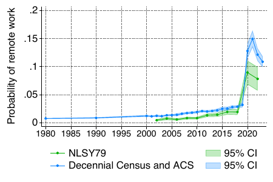

结果解读：远程办公份额在 1980 到 2019 年间缓慢爬升，2020 年陡然跳升、随后小幅回落。

另一边是工资溢价。溢价用「对数小时工资」对「远程指示变量」回归得到，控制与 logit 相同的人口学特征，NLSY 里再补上个体固定效应以吸收不随时间变化的个人能力差异。

```stata
* 职业层面的远程溢价：每多在家工作一小时的工资对数变化
* i.occ_group#c.xvar 给每个职业一个远程小时系数
reghdfe lhourly_rate xvar xvar_year i.occ_group#c.xvar tenure tenure2 age age2 ///
    [pw = c_sampweight] if sample_id <= 8 & year >= 2002, ///
    absorb(year person_id ind_group##c.year occ_group##c.year ///
           education_broad##c.year region##c.year married urban_rural) vce(robust)
```

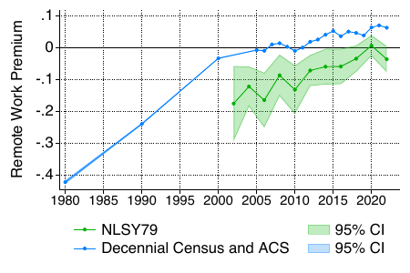

结果解读：远程办公的工资溢价在过去四十年稳步上升，唯独在 2018 到 2022 年间几乎持平。

两图放在一起是一个关键的对照：人数暴涨而溢价不动。技术跃迁或偏好冲击会同时推高远程办公的份额与回报，只有多重稳态能把两者拆开——份额涨是因为城市被推到了另一个稳态，而非远程技术本身变好了。这个对照是全文的起点，把问题引向多重稳态。


## 二、疫情后的城市异质性

同一次封锁冲击，不同城市留下了不同痕迹。这一节分三步：先看通勤流量，再看房价梯度，最后排除替代解释、给出多重稳态的直觉。

### 通勤模式的分化

一切空间分析的起点是「市中心在哪里」。CBD 从 SafeGraph 的访问足迹里搜出来，不靠行政边界。这一步需要 MATLAB 的 Mapping Toolbox 做测地线距离计算，写在脚本 `define_cbd.m` 里。

脚本先在每个都会区的中心附近铺一张 501×501 的网格，覆盖约 30 公里的范围（洛杉矶这种海岸城市，市中心不在几何中心，网格整体向东平移 15 公里）。对网格里的每一个候选圆心，统计半径 1 公里圆盘内的工作类访问量，取访问量最大的点作为 CBD 中心。一座城市最多允许 3 个 CBD（`n_cbds = 3`），以容纳曼哈顿中城 + 下城这样的多中心结构。

```matlab
% 网格搜索 CBD 中心：在都会区中心 30km 范围内铺 501x501 网格
% 对每个候选点，数半径 1km 圆盘内的访问足迹，取峰值作为 CBD
% LA 等海岸城市整体东移 15km，避免市中心落在海里
n_cbds = 3;  radius_km = 1;
% 用 Mapping Toolbox 算 CBG 到候选中心的测地线距离
```

CBD 的**成员身份**分两档：落在半径 1 公里圆盘内的街区组直接算作 CBD 街区组；落在 1–2 公里环形带内的街区组，只有当其访问量超过全都会区均值的 0.8 倍时才纳入。结果按每 100 个都会区一块写出 `cbds_3_lat_lon_radius_1_cbsa_X_to_Y.csv`，交给后续的 Stata 构建脚本读取。

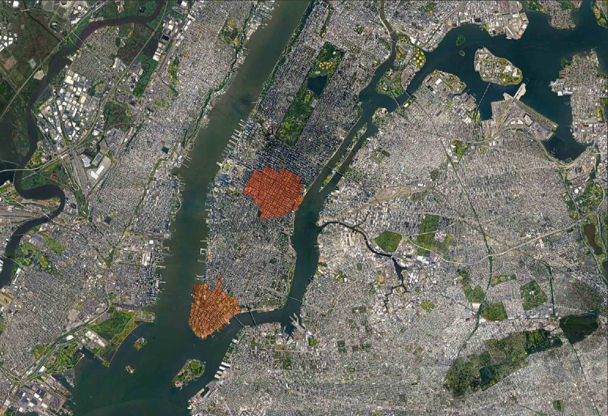

有了 CBD 坐标，把 SafeGraph 的月度足迹转成面板。原始数据的粒度是「出发街区组 × 目的街区组 × 月」，记录访问次数与设备数。脚本要做三件事：算距离、定义 CBD 访问份额、做样本筛选。

```stata
* 到 3 个 CBD 的距离取最小值：dist_to_cbd = min(到 CBD1, CBD2, CBD3 的测地线距离)
geodist lat_orig lon_orig lat_cbd1 lon_cbd1, gen(dist_to_cbd1) miles
geodist lat_orig lon_orig lat_cbd2 lon_cbd2, gen(dist_to_cbd2) miles
geodist lat_orig lon_orig lat_cbd3 lon_cbd3, gen(dist_to_cbd3) miles
gen dist_to_cbd = min(dist_to_cbd1, dist_to_cbd2, dist_to_cbd3)

* 是否落在 CBD 2km 圆盘内：一个 0/1 指示变量
gen in_cbd2km = dist_to_cbd <= 2

* 流向 CBD 2km 的设备数 = 全部设备数 × 指示变量
gen nb_devices_cbd2km = nb_devices_all_behavior * in_cbd2km

* 到 CBD 的访问份额 = 访问次数 / 出发地常住设备数
gen sh_visits = visits / number_devices_residing

* 出发地所在的 2010 普查区 = orig 前 11 位
gen orig_tract = substr(orig, 1, 11)

* 样本筛选：距 CBD 50km 以内，且出发区常住设备数超过 300
keep if dist_to_cbd <= ${radius_msa} & nb_devices_residing_tr > ${min_nbres_tr}
```

两个设计值得点明。一是**用常住设备数做分母**：SafeGraph 每月采样的设备总数会波动，直接用访问次数做分母会把采样波动误读为行为变化，所以脚本用「出发地常住设备数」标准化，得到的是真正的「访问倾向」。二是**`dist_to_cbd <= 2` 这个半径**：CBD 定位用 1 公里圆盘，但通勤流量统计放宽到 2 公里，因为 1 公里的圆盘太小，会把大量目的地在 CBD 边缘的访问漏掉。

接着估计每个城市到 CBD 的月度访问份额路径。做法是把每个月的份额相对 2020 年 1 月标准化，再做逐月回归。

```stata
* 2020 年 1 月对应 month_count == 13，作为基准月
local month_init "inlist(month_count, 13)"

* 每个出发区的基准份额 = 2020 年 1 月的到 CBD 访问份额
gen sh_visits_isel = sh_visits_cbd2km_tr if `month_init'
bys cbsa_dest orig_tract: egen sh_visits_i = mean(sh_visits_isel)

* 相对份额 = 当月份额 / 基准份额
gen sh_visits_r = sh_visits_cbd2km_tr / sh_visits_i

* 对月份指示变量回归，用 nlcom 还原每个月的水平值
reg sh_visits_r i.month_count if dist_to_cbd <= ${radius_msa} & nb_devices_residing_tr > ${min_nbres_tr}, robust
nlcom b_month`l': _b[_cons] + _b[`l'.month_count]
```

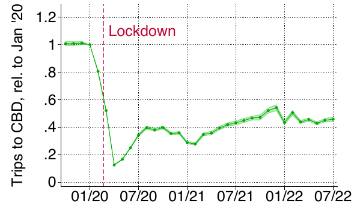

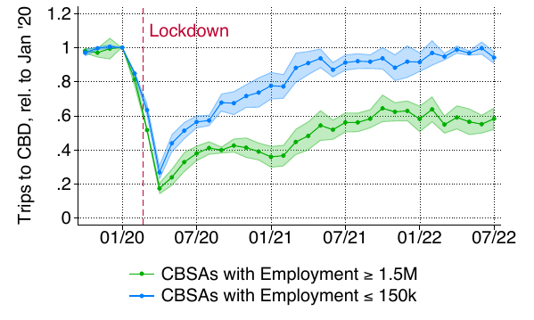

回归本身很简单，`i.month_count` 的系数就是每个月的相对份额水平。脚本的体力活在于两处：一是按城市规模分组（BEA 就业与普查就业两套口径，`employment_bea` 与 `nb_work_cbsa_2018`，阈值分别取 150 万与 15 万），二是用 `reghdfe ... cluster(region)` 对四个区域聚类标准误。结果是一个清晰的梯度：就业超过 150 万的最大城市组，通勤稳定在疫情前的六成；就业不足 15 万的最小城市组，几乎完全恢复。疫情初期的跌幅与城市规模无关，此后的恢复却与规模强相关。

### 房价距离梯度的分化

房价距离梯度是通勤需求的镜像：人们不愿每天跑太远，就会愿意为离市中心近的住房多付钱。这一节估计每个城市的房价距离梯度，看它在疫情后是否永久变平。

两个脚本分别处理 Zillow 的邮编级房价和 NHGIS 的街区组租金，逻辑一致：把「价格对数」对「到 CBD 的对数距离」回归，斜率就是距离梯度。Zillow ZHVI 的原始数据是宽表，每列一个月。脚本先丢掉 2000 年 1 月到 2015 年 12 月的列（`v10` 到 `v201`），只保留 2016 年 1 月及以后（`v202+`），再用 `fastreshape long` 把宽表变成长面板。

```stata
* 到 CBD 的距离取对数，加 1 避免零值取对数出错
gen ldist_zcta_cbd = log(1 + dist_zcta_cbd)

* 宽表转长表：v202 v203 ... → 单一 lv 变量 + month_count 标识月份
fastreshape long lv, i(zcta) j(month_count)

* 从 month_count 反推年份：v202 对应 2016 年 1 月
gen year = 2016 + floor((month_count - 1) / 12)
```

NHGIS 街区组租金的变量名是编码的（`al*`、`am*`），脚本先把它们重命名为可读变量，再取对数。租金数据用于估计租金梯度，它与房价梯度互补：房价是资产价格，租金是当期住房服务价格，两者从不同侧面反映「离市中心近」的价值。

主回归是「房价对数」对「到 CBD 的对数距离」的交互，`i.month_count#c.ldist_zcta_cbd` 给每个月一个距离斜率。

```stata
* bid-rent 回归：房价对数对 ln(距 CBD) 的逐月斜率
* i.month_count#c.ldist_zcta_cbd 给每个月一个距离斜率
reghdfe lvalues i.month_count#c.ldist_zcta_cbd `controls_geo', absorb(i.month_count)

* 取出每个月的距离斜率 b_dist 及其标准误
replace b_dist = _b[`l'.month_count#c.ldist_zcta_cbd]
replace s_dist = _se[`l'.month_count#c.ldist_zcta_cbd]
```

`controls_geo` 是一长串地理控制变量：收入中位数、高收入五分位份额、年龄中位数、黑人占比、面积、离河流/湖泊/海岸的距离、坡度、七月最高温、一月最低温、年降水量。这些变量来自空间插值，控制的是「哪些街区本来就更贵」，让距离斜率的估计更干净。

按规模分组时，脚本改用 `absorb(cbsa#month_count)`，把城市×月份固定效应吸收掉，只在城市内部比较不同距离的房价差异。同时计算一个「梯度平坦化」指标：把 2020 年 1 月、2021 年 1 月、2024 年 11 月的距离斜率分别取均值，后两者减去前者就是梯度的变化，它后来成为福利分析里的因变量。

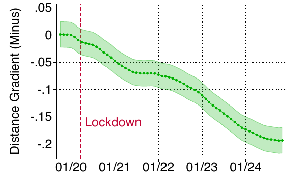

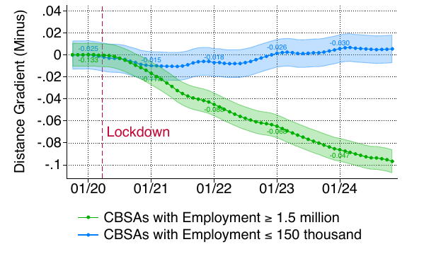

结果解读：大城市的房价距离梯度永久变平，小城市的梯度在短暂下探后回到原值。房价移动比通勤慢，但方向一致。

### 为什么是多重稳态

通勤与房价两条证据拼出一个事实：大城市永久换到了低通勤状态，小城市回到了原位。替代解释都不成立。可远程化职业的份额在大小城市之间只差十几个百分点，不足以解释六成与零的差距；大城市的拥堵反而更高（疫情前到大中心的通勤占比 30.6%，小城市只有 15.6%），说明大城市的中心本来更有价值；企业集中度上，小城市的大企业占比更低，所以「大企业把员工拉回办公室」也解释不了小城市的恢复。

剩下的一种解释是协调问题：办公室的价值取决于有多少人也在办公室，这个机制有两个自洽方向。相位图能直观呈现这一点——横轴是本期通勤人数，纵轴是下期通勤人数，稳态是与 45 度线的交点。唯一稳态的城市从任何起点都会被拉回原稳态；多重稳态的城市有两个稳定交点夹一个不稳定交点，疫情把通勤人数打到不稳定交点之下，城市就滑向低通勤稳态，再也回不去。下一节把这个直觉写成模型。


## 三、模型与多重稳态

模型是一座圆盘形的封闭城市，人口规模 L 固定，市中心在圆心。时间是离散的，工人每期先在一个既定的办公方式（通勤 c 或远程 m）下工作，再观察两个方式的随机偏好冲击，为下一期选择办公方式。

### 生产与技术

市中心生产同质最终品，一个效率单位的劳动产出一单位商品，价格标准化为 1。工人的效率单位、因而工资，取决于办公方式。关键是市中心的有效劳动量：

$$ \tilde{L}_c \equiv L_c^{\mu} L^{1-\mu} $$

其中 $L_c$ 是通勤人数，$\mu$ 是远程工人每周在家的天数比例。通勤者的工资是 $w_c = \bar{w}\, A\, \tilde{L}_c^{\delta}$，远程者的工资是 $w_m = \bar{w}\, z^{\mu}\, (A\, \tilde{L}_c^{\delta})^{1-\mu}$。两个参数由此进入模型：$A$ 是办公室生产率，$z$ 是远程技术，$\delta > 0$ 是集聚外部性——多一个人来市中心，所有人的效率单位都涨一点。远程者的工资是远程与办公室两种技术按 $\mu$ 加权的组合，因为混合办公者有一部分时间也在市中心。

### 工人的问题

工人住在离市中心距离 $d$ 的位置，效用是消费 $Q$ 与住房 $H$ 的 Cobb-Douglas 组合，权重 $\alpha$ 是消费支出份额。住得离市中心近，通勤成本低，但房租高。远程者每周通勤 $\mu$ 天，对距离的敏感度只有通勤者的 $(1-\mu)$ 倍，所以他们愿意住的更远，愿意为市中心近处付的溢价也更低。这个差异正是房价距离梯度的微观来源。

市中心的吸引力 $B(\tilde L_c)$ 随有效劳动量上升（弹性 $\xi$），拥堵成本 $\tau(\tilde L_c)$ 也随有效劳动量上升（弹性 $\theta$）。通勤成本随距离的弹性是 $\gamma$。这四个弹性——$\delta$、$\xi$、$\theta$、$\gamma$——决定了协调问题的强度。

动态部分引入两个摩擦：每期有一个服从 Gumbel 分布的随机偏好冲击，尺度参数 $s$ 衡量冲击的离散度；从通勤切到远程（或反向）要付固定成本 $F$。工人在期初状态 $\ell$ 下享受当期效用 $u_\ell$，观察冲击，选择下一期状态，价值函数是当期效用加贴现的延续值再加切换成本与冲击的最大值。

### 均衡与多重性

均衡分为三层：给定当期通勤人数的期内均衡（租金函数使住房市场出清）、动态均衡（价值函数与转移概率自洽）、以及所有内生变量不随时间变化的稳态。模型维持两个假设：$B(\cdot)$ 与 $\tau(\cdot)$ 是等弹性函数，且冲击离散度 $s$ 足够大，保证纯远程均衡不会成为角点解。在这个框架下，三个命题层层递进。

**命题 1（存在性）**：稳态总是存在。证明要点：把稳态刻画约化为单变量方程 $f(\lambda) = 1/(1+\exp(\bar\epsilon_{cm}/s)) - \lambda = 0$，其中 $\lambda$ 是「本期通勤、下期仍通勤」的份额。当几乎人人通勤（$\lambda \to 1$）时，切向远程的平均收益 $\bar\epsilon_{cm}$ 趋于正无穷，$f$ 趋于负；当几乎人人远程（$\lambda \to 0$）时，$\bar\epsilon_{cm}$ 趋于负无穷，$f$ 趋于正。由连续性，中间必有一个根。

**命题 2（唯一性）**：若 $\delta + \xi < \theta + \gamma/(2\mu)$，稳态唯一，且通勤人数随办公室生产率 $A$ 与市中心吸引力 $B$ 上升、随远程技术 $z$ 与拥堵 $\tau$ 下降。证明要点：这个条件下，远程相对通勤的当期效用差 $e_f(\lambda)$ 随 $\lambda$ 单调上升，加上期权价值差 $e_o(\lambda)$ 本就单调上升，切换收益 $\bar\epsilon_{cm}$ 单调，$f$ 单调下降，只穿过零一次。直觉上，集聚与宜居力量弱于拥堵力量时，人越多反而越想躲开，城市只有一个稳态。

**命题 3（多重性）**：若 $\delta + \xi$ 超过一个门槛 $\eta_{min} > \theta + \gamma/(2\mu)$，则存在一个非空区间 $(Z_{min}, Z_{max})$，当 $z/A$ 落在其中时存在多重稳态。证明要点：对每个候选 $\lambda$，都能找到一个 $z/A$ 使它是稳态（即 $\varphi(\lambda)$ 满射）；同时，只有当 $\delta+\xi$ 高于一个 $\lambda$ 的凸函数 $\hat\delta(\lambda)$ 的最小值 $\eta_{min}$ 时，$f$ 在稳态处的斜率为正。两个条件合起来，把「多重性」翻译成 $z/A$ 落在某个区间内。

这个区间就是正文里的「多重性锥」。命题 3 还说明锥的上下界 $Z_{min}$、$Z_{max}$ 随城市规模 $L$ 与吸引力 $B$ 上升、随远程福利 $T$ 与拥堵 $\tau$ 下降——大城市的锥更宽，更容易落进去。

锥的数值求解没法在 Stata 里完成，写在 Mathematica 笔记本 `analysis_multiplicity.nb` 里。核心是解 $\hat\delta(\lambda) = \delta + \xi$ 的实根：根的数量就是稳态的数量。

```mathematica
(* 求解 deltaHat[λ] == deltaPlusXi 在 λ∈(0,1) 内的实根 *)
(* 根的数量 = 稳态数量；三个根 = 多重性 *)
\[Lambda]set = \[Lambda] /. NSolve[
    deltaHat[\[Lambda], \[Mu], fcc, fmm, fmc, fcm, s, \[Beta], \[Gamma], \[Theta]] == deltaPlusXi
        && \[Lambda] > 0 && \[Lambda] < 1, \[Lambda], Reals];

(* 每个根对应一个 z/A，用 rho 函数把 λ 映射到 z/A *)
zOverAset = rho[\[Lambda]set, \[Mu], fcc, fmm, fmc, fcm, s, \[Beta], BbarOverTauT, L, deltaPlusXi, \[Gamma], \[Theta]];
```

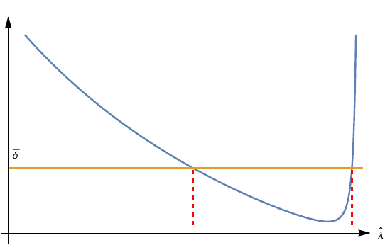

`deltaHat` 与 `rho` 就是命题 3 证明里的 $\hat\delta(\lambda)$ 与 $\varphi(\lambda)$：前者把每个通勤份额 $\lambda$ 映射成「使它是稳态所需的 $\delta+\xi$」，是一条 U 形曲线；后者把 $\lambda$ 映射成对应的 $z/A$。城市观测到的 $\delta+\xi$ 是一条水平线，与 U 形曲线的交点个数就是稳态个数。脚本遍历 $z/A$ 的取值范围，把「有三个稳态」的区间记为 `[coneLow, coneHigh]`，这就是每个城市的锥。


## 四、量化估计

模型刻画好后，逐个估计参数。量化只用 2019 年之前的数据——那时每个城市都还处在高通勤稳态，估计不依赖「哪个稳态正在实现」。四个参数逐个来：转移弹性与切换成本、集聚外部性、远程技术、交通成本弹性。

### 转移弹性与切换成本

动态离散选择模型有两个关键参数：转移弹性 $s$（远程相对工资每变动 1%，工人转向远程的转移概率变动多少）和固定切换成本 $F$。直接估计需要求解完整动态规划，计算量巨大。条件选择概率（CCP）方法绕开求解。

用 NLSY79 面板构造转移概率，再回归反解参数。先看数据构造：

```stata
* 面板每两年一期，贴现因子 = 0.96^2（按两年折现）
global beta = 0.96^2

* 四种状态转移：become_remote / stay_remote / become_commute / stay_commute
* 每个状态 = (上一期是通勤/远程) 与 (本期是通勤/远程) 的四种组合
replace become_remote = 1 if is_commute_before == 1 & is_remote_after == 1

* 按"地区×教育"分组，构造组内转移份额
bys year ${group}: egen sh_become_remote = mean(become_remote)

* 相对转移概率的对数（Lemma 1 左侧）
* 分子 = 本期转向远程 × 下期保持远程（按 β 贴现）
* 分母 = 本期保持通勤 × 下期转向远程
gen sh_become_remote_stay = sh_become_remote * sh_stay_remote_p1^(${beta})
gen sh_stay_become_remote = sh_stay_commute * sh_become_remote_p1^(${beta})
gen yvar = log(sh_become_remote_stay / sh_stay_become_remote)
```

这里的关键是**一期偏离技巧**。标准的动态离散选择，工人今天的决策依赖明天的延续值，而延续值本身又是未来决策的函数，形成无限递归。但如果把「本期转向远程且下期保持」与「本期保持通勤且下期转向」这两个路径相比，它们的延续值在两期之后重新回到同一个位置，于是延续值项相互抵消，剩下一条只含当期效用与切换成本的对数线性关系。

```stata
* 控制变量：下一期远程相对通勤的对数工资
gen x1 = lhourly_rate_remote_avg_p1 - lhourly_rate_commute_avg_p1

* 工资比带测量误差会使 OLS 下偏，用滞后一期的工资比作工具变量
ivregress 2sls yvar_pred (x1 = x_m1) d_sign d_t d_lLc_p1 d_lL_p1 if year <= 2016, r

* 由系数反解参数：s = β / 工资系数，F = -(1-β)F / s
nlcom s: ${beta} / _b[x1]
nlcom F: -${beta} / (1 - ${beta}) * _b[_cons] / _b[x1]
nlcom gamma: 2 / _b[x1] * (_b[d_lLc_p1] / ${mu} - _b[d_lL_p1] / (1 - ${mu}))
nlcom ximtheta: -1 / (${mu} * (1 - ${mu})) * _b[d_lL_p1] / _b[x1]
```

回归方程里除了相对工资，还有三个控制项：`d_sign`（转向远程取 +1、转向通勤取 -1，捕捉不对称的切换成本）、`d_t`（时间趋势）、`d_lLc_p1` 与 `d_lL_p1`（下一期通勤人数与总人数的对数，捕捉集聚与拥堵如何影响转移决策）。`nlcom` 用 Delta 方法从回归系数反解出结构参数。

估计结果：转移离散度 $s$ 约 0.30，意味着远程相对工资每上升 1%，转入远程的转移概率上升约 3%；切换成本 $F$ 约 1.78，等价于放弃约 83% 的年收入才能完成一次模式切换。这么大的成本解释了为什么工资差虽存在，工人的实际流动仍然很低。`nlcom gamma` 与 `nlcom ximtheta` 反解出通勤成本弹性 $\gamma$ 与住房/拥堵弹性之差 $\xi - \theta$，后者估计不精确，留待校准。

### 集聚外部性

集聚外部性 $\delta_j$ 随城市而异，直接决定多重性判定。直接回归通勤工资对通勤份额的变化会遇到内生性：通勤份额的变化本身可能源于本地生产率冲击。识别用份额移动（shift-share）工具变量。

工具变量的构造是经典的 Bartik 思路：用 1980 年各城市的职业构成固定住「结构」，用全国层面各职业通勤份额的变化提供「外生变化」，两者相乘得到一个通勤份额的预测值。

```stata
* 远程工作份额 μ = 3/5，时间滞后 3 年（mm = 3）
global mu = 3/5
local mm 3

* 份额移动 IV：Σ_s (城市 j 职业 s 的初始份额) × (全国职业 s 通勤份额的变化)
* shtot_init 是 1980 年（或用前后期增长外推的）初始职业份额
* Dlshc_occ_m3 是全国层面各职业通勤份额的 3 年变化
bys cbsa year: egen IV = total(shtot_init * Dlshc_occ_m`mm'), missing

* 集聚系数按 5 个行业组估计：δ_j = β_0 + Σ_g β_g · (行业 g 的劳动增加值加权就业份额)
* 每个交互项对应一个内生变量与一个工具变量
foreach var in `deltavars' {
    local xvars   = "`xvars'"   + " c.`var'#c.Dlshc_cbsa_m`mm'"
    local ivvars  = "`ivvars'"  + " c.`var'#c.IV"
}

* OLS 与 IV 都在高维固定效应下估计
reghdfe Dwcommute_m`mm' `xvars', absorb(cbsa##c.DlLtot_cbsa_m`mm' year) vce(cluster qL)
ivreghdfe Dwcommute_m`mm' (`xvars' = `ivvars'), absorb(cbsa##c.DlLtot_cbsa_m`mm' year) vce(cluster qL)
```

回归的被解释变量是通勤工资的 3 年变化 `Dwcommute_m3`，解释变量是通勤份额变化的 3 年差分 `Dlshc_cbsa_m3`，两者的交互项系数即集聚弹性。固定效应 `cbsa##c.DlLtot_cbsa_m3` 吸收了「城市固定效应 × 总就业变化的斜率」，即允许每个城市的工资随规模有不同的趋势，这是识别集聚外部性时的标准做法。

`deltavars` 里的五个行业组是：健康与教育、专业与其他服务、制造业、批发/运输/住宿，以及一个常数项（非贸易部门）。每个城市的 $\delta_j$ 由这五个系数与其行业构成线性组合得到，再除以 $\mu$：

```stata
* 城市级 δ_j = (Σ_g β_g · 行业 g 的份额 + β_0) / μ
gen delta = 0
foreach var in `deltavars' {
    qui sum `var' if cbsa == `cbsa_cc'
    local var_val = r(mean)
    replace delta = delta + `var_val' * _b[c.`var'#c.Dlshc_cbsa_m`mm'] / $mu if cbsa == `cbsa_cc'
}
```

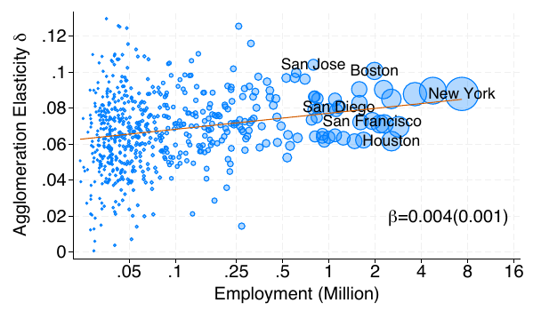

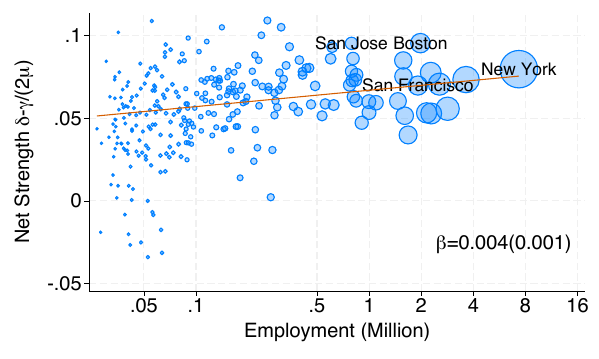

脚本还做了两件事：一是报告第一阶段 FWL 的 $R^2$（把 `Dlshc_cbsa_m3` 与 `IV` 分别对固定效应做残差化，再回归残差），检验工具变量的相关性；二是逐年份剔除的稳健性检验，确认 $\delta$ 的估计不依赖某一年。结果：城市级集聚弹性的均值约 0.067，且随城市规模上升。

### 远程工资溢价与技术

远程技术参数 $z$ 是模型里「在家工作的生产率」。它不能直接观测，从工资溢价反推。第一节估计的是全国层面的溢价趋势，这里进一步把溢价拆到职业、再按城市职业构成加权。

```stata
* 职业 o 在第 yy 年的溢价 = 24 × (基础系数 + 时间趋势×yy + 职业固定效应)
nlcom wpremium_trend_`oo'_`yy': ${nhours_nlsy} * _b[xvar] + ///
    ${nhours_nlsy} * _b[xvar_year] * `yy' + ${nhours_nlsy} * _b[`occ_oo'.occ_group#c.xvar]
```

NLSY 里远程办公是连续变量（每周在家小时数），`xvar` 即 `home_hours`，`nhours_nlsy = 24` 把系数换算成「每周在家 24 小时」的总溢价。普查/ACS 里远程是 0/1 指示变量，`nhours_census = 1`，直接取系数。两个样本分别估计，再对照。

关键的一步在最后：**从职业溢价到城市溢价**。脚本对每个都会区，用 2018 年的职业就业份额对职业系数做加权线性组合：

```stata
* 城市 cbsa 的溢价 = Σ_o (职业 o 在 cbsa 的就业份额) × (职业 o 的远程小时系数)
* 构造线性组合字符串，用 nlcom 一次性算出
local lincom_string "${nhours_nlsy} * _b[xvar] + ${nhours_nlsy} * _b[xvar_year] * `yy'"
foreach oo in occ_list {
    qui sum sh_occ_group_cbsa if occ_group == `occ_oo' & cbsa == `met_mm'
    local sh_occ_met = r(mean)
    local lincom_string "`lincom_string' + `sh_occ_met' * ${nhours_nlsy} * _b[`occ_oo'.occ_group#c.xvar]"
}
nlcom wpremium_trend_`mm'_`yy': "`lincom_string'"
```

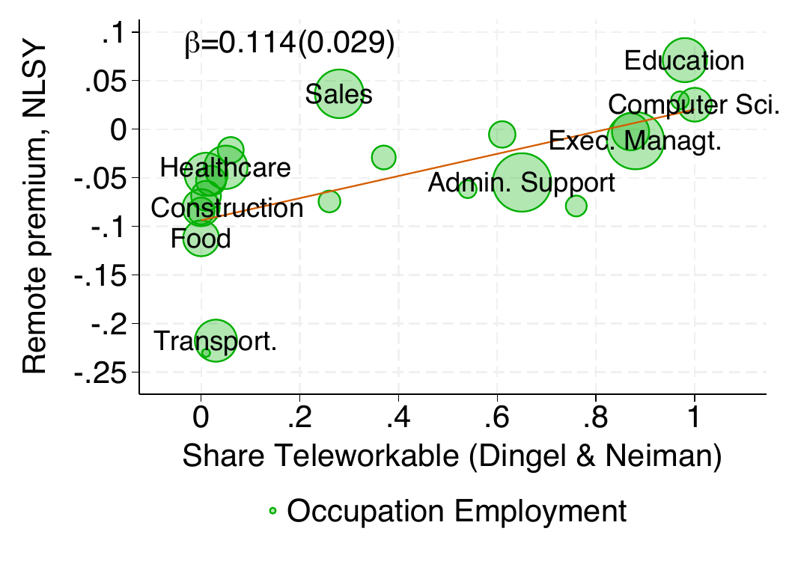

远程溢价在职业间差异很大：程序员、高管高，食品服务、建筑低，且随职业的可远程化程度上升。城市级溢价同样随可远程化份额上升。这一串系数最终映射到远程技术参数 $z$ 与办公室技术 $A$：$z_j = \exp(\psi_j/\mu)\, w_{cj}$，$A_j = \tilde L_{cj}^{-\delta_j}\, w_{cj}$。估计出 $z$ 的均值约 16.6，$z/A$ 的均值约 2.05。

### 交通成本弹性

交通成本弹性 $\gamma_j$ 从租金距离梯度反解。模型推导出租金对距离的平均弹性 $\kappa$ 与 $\gamma$ 的关系：$\kappa = -\frac{\gamma}{1-\alpha}[1-\mu+\mu\sqrt{L_c/L}]$。于是从估计出的租金梯度就能反推 $\gamma$。

租金梯度用 NHGIS 的街区组租金估计：把「对数租金」对「到 CBD 的对数距离」回归，控制种族构成、住房结构、卧室数、建造年代与地理变量。这一回归就是第二节房价梯度在租金上的对应版本，区别在于租金是当期住房服务价格，反解出的 $\gamma$ 更直接进入模型。

```stata
* 通勤成本弹性 γ：由住房弹性、非住房支出份额与通勤份额反解
gen gamma = -epsilon * (1 - alpha) / (1 - mu + mu * (Lc / L)^(1/2))
```

$\gamma$ 的均值约 0.027。有了 $\gamma$ 和 $\delta_j$，就能算每个城市的净集聚力 $\delta_j - \gamma_j/(2\mu)$——这是命题 3 里决定多重性的关键统计量。

### 其余参数的校准

剩余参数从文献校准：住房弹性与拥堵弹性 $\xi = \theta = 0.15$，消费支出份额 $\alpha = 0.76$，远程工人每周在家天数 $\mu = 3/5$。$\tau$ 逐城校准，使模型 2019 年的通勤份额匹配观测值。这些参数与估计值组装成逐城的模型输入。

```stata
* 远程技术 z = exp(远程溢价 / μ) × 通勤工资
gen z = exp(dummy_remote / mu) * hwage_commuters

* 相对远程生产率 z/A = exp(远程溢价 / μ) × (Lc^μ · L^(1-μ))^δ
gen zovera = exp(dummy_remote / mu) * (Lc^mu * L^(1 - mu))^delta

* CBSA 代码跨年合并：31080 与 31100 是同一都会区
replace cbsa = 31100 if cbsa == 31080
```

`dummy_remote / mu` 就是估计出的城市级远程溢价，代入 $z = e^{\psi_j/\mu} \cdot w_c$ 与 $z/A = e^{\psi_j/\mu} \cdot \tilde{L}_c^{\delta_j}$，其中 $\tilde{L}_c = L_c^{\mu} L^{1-\mu}$ 是有效办公室劳动。至此，每个城市都有了自己的 $\delta_j$、$z_j/A_j$、$\gamma_j$。


## 五、对暂时冲击的永久响应

参数齐全后，逐城判定它在不在自己的多重性锥内。多重性条件来自命题 3：当 $\delta + \xi$ 超过门槛、且 $z/A$ 落在一个区间内时，模型存在多个稳态。锥的上下界 `conelow`、`conehigh` 由上一节的 Mathematica 求解给出。

```stata
* 锥内判定：z/A 落在 [conelow, conehigh] 之间
gen in_cone = zovera >= conelow & zovera <= conehigh

* 净集聚力 = δ - γ / (2μ)
gen netstrength = delta - gamma / (2 * mu)

* 锥内判定是否预测了实际的通勤变化
reg pcttripchange in_cone
probit is_back in_cone
* is_back = 1 表示通勤恢复到疫情前 5% 以内，0 表示仍低于 20%
```

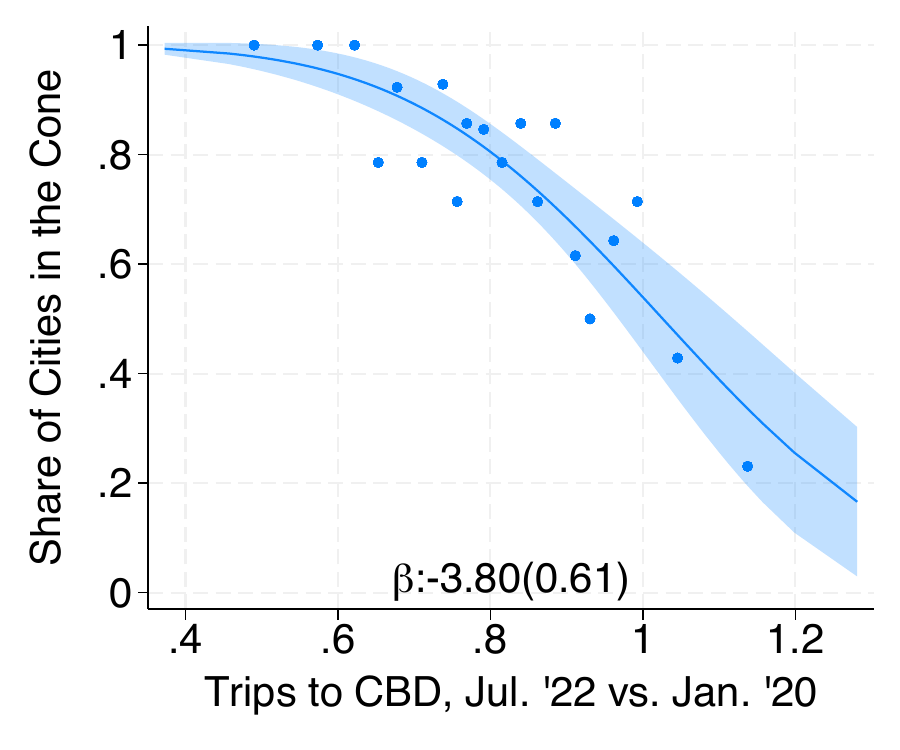

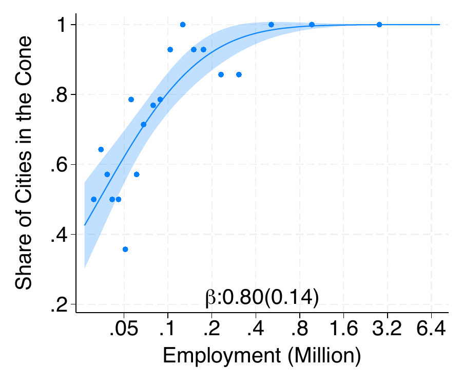

对参数齐全的 278 个都会区，208 个在疫情前处于各自的多重性锥内。锥内概率随通勤缺口上升、随房价梯度平坦化上升、随城市规模上升。换句话说，模型判定的「可能被永久改变」的城市，正是数据里通勤真正停摆的城市。

这个判定不是事后诸葛亮。脚本进一步做了一组回归，把锥内指示变量 `in_cone` 放进通勤缺口的回归，看它是否在控制了可远程化份额、2019 年通勤占比、行业构成与城市规模之后仍然显著。结果是它始终是最强的预测变量。正文把这一组结果总结成一张决定因素表：锥内城市的通勤缺口显著更大，「通勤恢复到疫情前 5% 以内」的概率显著更低。协调机制发生在企业边界之外，单靠个别企业的返岗政策难以把城市拉回原稳态。


## 六、福利

最后算福利。切换稳态的代价是把高通勤稳态与低通勤稳态的总福利相比。福利差没法在 Stata 里解，同样写在 Mathematica 里：对每个锥内城市，先解出三个稳态下的价值函数、通勤者与远程者的工资 `wc`/`wm`、通勤份额 `lcsharess`，再比较两个稳定稳态。

```mathematica
(* 福利差 = 低通勤稳态的总福利 / 高通勤稳态的总福利 *)
welfareLowOverHigh = (lcsharess[[1]] * wc[[1]] + (1 - lcsharess[[1]]) * wm[[1]]) /
                     (lcsharess[[3]] * wc[[3]] + (1 - lcsharess[[3]]) * wm[[3]]);

(* 通勤差 = 低稳态的通勤次数 / 高稳态的通勤次数 *)
tripLowOverHigh = (lcsharess[[1]] + (1 - lcsharess[[1]]) * \[Mu]) /
                  (lcsharess[[3]] + (1 - lcsharess[[3]]) * \[Mu]);
```

`welfareLowOverHigh` 小于 1 表示福利损失。脚本把所有城市的 `[coneLow, coneHigh, WelfareDiff, relWageDrop, ...]` 写出 `calibration/allCitiesCones.csv`，交给 Stata 出图。

读入这个 CSV 后做福利分解：

```stata
import delimited "${pathIn}allCitiesCones.csv", clear

* 锥内判定（与上一节的判定一致）
gen in_cone = zovera >= conelow & zovera <= conehigh

* 净集聚力
gen netstrength = delta - gamma / (2 * ${mu})

* 福利损失（百分比，正数 = 损失）
gen welfare_pct = (1 - welfarediff) * 100 if in_cone == 1
* 工资损失
gen wage_pct = (relwagedrop - 1) * 100 if in_cone == 1
* 福利分解：净福利 = 工资损失 + 通勤/期权价值收益
gen residual_welfare_change = welfare_pct_gain - wage_pct if in_cone == 1

* 锥内份额 vs 通勤缺口 / 房价梯度 / 规模 / δ / γ / z/A
probit in_cone tripfinal, r
probit in_cone flattening, r
probit in_cone logemp, r
```

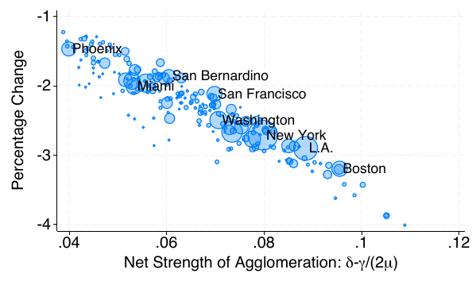

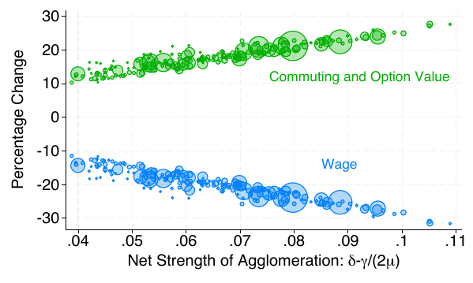

福利核算的结果：对 208 个锥内城市，切换到低通勤稳态的平均福利损失 2.3%，中位数 2.2%，范围从 1.2% 到 4.0%。这个净损失温和，是两个大数相抵的结果：工资下降 15% 到 35%，被通勤成本节省与期权价值的变化大幅抵消。福利损失集中在通勤下降到疫情前六成左右的城市，其居民平均损失约 2.7%。净集聚力越强，福利损失越大。


## 结语

这套代码的价值在于它把一篇结构估计论文完整地落成了可运行的流水线：从手机定位数据里搜出 CBD，从工资面板里反解转移弹性与远程溢价，从份额移动工具变量里识别集聚外部性，最后在 Mathematica 里解出每个城市的多重性锥与福利代价。每一步都对应论文的一个命题或一张表，代码与论文相互印证。

三处细节值得展开。一是**条件选择概率**用一期偏离把无限递归的动态规划压成一条线性方程，用 NLSY 的两期转移份额就能反解出 $s$ 与 $F$，这是动态离散选择估计里最实用的技巧之一。二是**份额移动工具变量**用「1980 年的职业结构 × 全国职业趋势」剥离集聚识别的内生性，`ivreghdfe` 在高维固定效应下对每个交互项分别构造工具。三是**多重性锥的判定**把「这座城市是否会被永久改变」这个复杂问题，压缩成 $z/A$ 是否落在一个区间内的简单检验，而区间的上下界由 Mathematica 数值求解给出。

如果你手头有 Stata 与 MATLAB、Mathematica 的许可，可以照 `rundirectory.sh` 的顺序完整跑一遍；没有原始数据的话，`output/` 里的中间产物足够把分析层与图层的代码跑通。祝复现顺利。

> 🍓如有疑问或建议，欢迎在评论区或者后台留言交流。
>
> 🍓感谢阅读，祝研究顺利。
